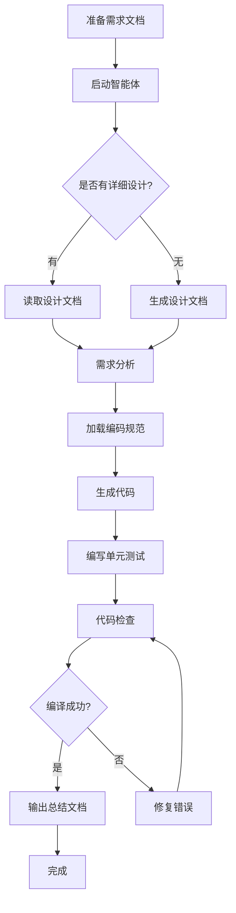

# Java 后端编码智能体 - 概览

## 智能体简介

**Java 后端编码智能体**是一个专业的后端代码生成工具，能够根据需求文档和详细设计文档自动生成符合公司规范的高质量 Java 后端代码。

### 核心能力

- 📋 **需求分析**: 深度解析需求文档，识别功能点和变更影响
- 🏗️ **架构设计**: 基于分层架构自动生成完整的项目结构
- 💻 **代码生成**: 生成符合规范的 Controller、Service、DAO 层代码
- 🗄️ **数据库设计**: 自动设计物理表结构和数据模型
- ✅ **单元测试**: 自动生成完整的单元测试代码
- 📝 **文档输出**: 生成详细设计文档和接口文档

### 适用场景

1. **新功能开发**: 根据需求文档快速生成完整的后端代码
2. **功能变更**: 识别历史功能影响，生成变更代码
3. **代码重构**: 按照最新规范重构现有代码
4. **接口开发**: 快速生成标准化的 RESTful API

## 技术栈

| 技术 | 版本/说明 |
|------|----------|
| **框架** | Spring Boot |
| **JDK** | 1.8 |
| **数据库** | MySQL / Oracle（兼容） |
| **依赖管理** | Maven |
| **数据访问** | JPA + 自定义 ORMap 框架 |
| **API 文档** | Swagger |

## 核心特性

### 1. 智能需求分析

- 自动识别业务场景和功能点
- 分析新增功能与历史功能的关联
- 确定功能优先级和依赖关系
- 识别修改入口和关键信息

### 2. 规范化代码生成

- 严格遵循公司编码规范
- 自动应用设计模式和最佳实践
- 生成符合安全规范的代码
- 支持多种业务场景（缓存、消息、调度等）

### 3. 完整的开发流程

智能体按照以下 9 个步骤执行：

1. **准备阶段**: 读取需求文档和详细设计文档
2. **需求分析**: 深度解析功能点和影响范围
3. **规范读取**: 加载相关编码规范和样例
4. **设计阶段**: 生成详细设计文档（如不存在）
5. **编码阶段**: 生成后端代码
6. **单元测试**: 编写完整的测试用例
7. **检查阶段**: 验证代码完整性和编译状态
8. **总结阶段**: 输出总结和接口文档

### 4. 多场景支持

根据需求场景自动加载相应规范：

- 🔄 **任务调度**: 定时任务和调度逻辑
- 💾 **缓存读写**: Redis 缓存操作
- 📨 **消息收发**: 消息队列处理
- 📁 **非结构化**: 文件存储和处理
- ⚡ **异步处理**: 异步任务执行
- 🗃️ **数据交互**: 数据库 CRUD 操作
- 📥 **导入导出**: Excel 导入导出功能

## 项目架构

### 分层架构

```
Controller 层 → Service 层 → DAO 层 → Domain 层
```

### 目录结构

```
com.ygsoft.{产品域}.{模块简称}/
├── boot/              # 应用启动类
├── controller/        # 控制器层
├── domain/            # 数据模型
│   ├── vo/           # 视图对象
│   ├── bo/           # 业务对象
│   ├── po/           # 持久化对象
│   └── transfer/     # 模型转换
├── service/           # 服务层
│   ├── application/  # 业务服务
│   └── query/        # 查询服务
├── infrastructure/    # 基础设施
│   ├── util/         # 工具类
│   ├── config/       # 配置类
│   └── constant/     # 常量类
├── dao/              # 数据访问层
├── schedule/         # 定时任务
└── consumer/         # 消息消费者
```

## 输入与输出

### 输入要求

1. **需求文档**（必需）
   - Markdown 格式
   - 包含完整的业务场景描述
   - 明确的功能点说明

2. **详细设计文档**（可选）
   - Markdown 格式
   - 包含数据库设计
   - 接口设计说明

### 输出内容

1. **源代码文件**
   - Controller、Service、DAO 层代码
   - 数据模型（VO、BO、PO）
   - 配置文件

2. **单元测试**
   - 正向测试用例
   - 反向测试用例
   - 边界和异常测试

3. **文档**
   - 详细设计文档（如不存在）
   - 接口文档（包含请求/响应参数）
   - 总结文档（实现功能清单）

## 使用流程



## 核心优势

### 1. 高效率
- 自动化代码生成，大幅减少开发时间
- 标准化流程，避免重复劳动

### 2. 高质量
- 严格遵循编码规范
- 自动生成单元测试
- 代码编译检查

### 3. 易维护
- 统一的代码风格
- 完整的文档输出
- 清晰的架构设计

### 4. 可扩展
- 支持多种业务场景
- 灵活的规范配置
- 可集成子智能体

## 注意事项

1. **需求文档必需**: 没有需求文档时智能体会退出
2. **规范遵循**: 生成的代码严格遵循公司规范
3. **增量变更**: 修改现有功能时采用增量变更原则
4. **编译检查**: 会自动检查代码编译状态
5. **内容完整性**: 确保生成的代码内容不被截断

## 下一步

- 📖 阅读 [架构文档](./02-architecture.md) 了解详细的项目结构
- 🔄 查看 [执行流程](./03-workflow.md) 了解智能体工作流程
- 📝 参考 [编码规范](./04-coding-standards.md) 了解代码规范要求
- 🗄️ 学习 [SQL 规范](./05-sql-standards.md) 了解数据库设计规范
