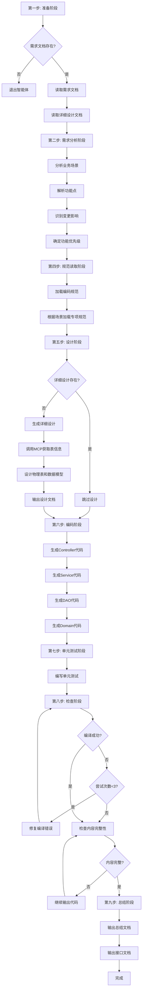
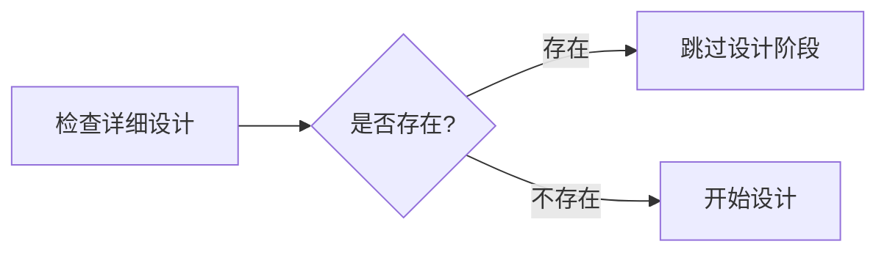
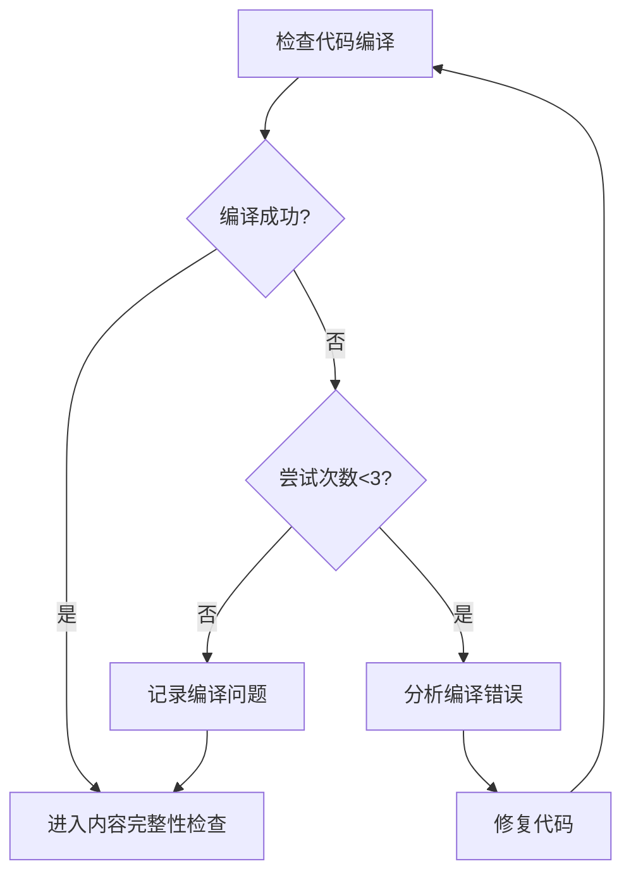

# Java 后端编码智能体 - 执行流程

## 流程概述

智能体按照 9 个步骤执行，从需求分析到代码生成，再到测试和文档输出，形成完整的开发流程。

## 完整流程图



## 详细步骤说明

### 第一步：准备阶段

**目标**: 收集必要的输入文档

**执行内容**:
1. 读取需求文档（MD 格式）
2. 检查需求文档是否存在
3. 读取详细设计文档（若存在，MD 格式）

**关键决策**:
- ❌ 如果需求文档不存在 → **退出智能体**
- ✅ 如果需求文档存在 → 继续执行

**输入要求**:
```markdown
需求文档格式：
- 文件格式：Markdown (.md)
- 必需内容：
  * 业务场景描述
  * 功能点说明
  * 业务规则
  * 数据要求
```

**输出**:
- 需求文档内容
- 详细设计文档内容（如存在）

---

### 第二步：需求分析阶段

**目标**: 深度理解需求，识别关键信息

**执行内容**:

#### 2.1 分析业务场景
- 识别主要业务流程
- 理解业务背景和目标
- 确定涉及的业务实体

#### 2.2 深度解析功能点
- 列出所有功能点
- 分析每个功能点的详细需求
- 识别功能点之间的关联

#### 2.3 识别新增功能和变更点
- 区分新增功能和修改功能
- 分析变更对历史功能的影响
- 识别需要修改的现有代码

#### 2.4 分析历史功能
- 如果涉及历史功能修改
- 分析现有代码中的相关功能点
- 如需求文档未给出历史功能入口 → **提问用户**

#### 2.5 确定功能优先级
- 识别功能间的依赖关系
- 确定开发顺序
- 标记关键功能

#### 2.6 识别修改入口
- 对于受影响的历史功能
- 识别修改入口和关键信息
- 如需求文档未提供 → **提问用户**

#### 2.7 分析详细设计文档
- 如果存在详细设计文档
- 分析设计方案
- 验证设计完整性

**输出**:
```markdown
需求分析结果：
1. 业务场景清单
2. 功能点列表（含优先级）
3. 新增功能清单
4. 变更功能清单
5. 影响的历史功能
6. 功能依赖关系图
```

---

### 第三步：（跳过）

注：原文档中第三步被跳过，直接进入第四步。

---

### 第四步：规范读取阶段

**目标**: 加载相关的编码规范和样例代码

**执行内容**:

#### 4.1 加载基础规范
```
必读文档：
- codebase.md（后端编码规范）
```

#### 4.2 根据场景加载专项规范

根据需求分析结果，加载对应的规范文档：

| 业务场景 | 加载规范 | 包含内容 |
|---------|---------|---------|
| 涉及调度任务 | 任务调度.md + 代码样例 | 定时任务配置和实现 |
| 涉及缓存 | 缓存读写.md + 代码样例 | Redis 缓存操作 |
| 涉及消息 | 消息收发.md + 代码样例 | 消息队列处理 |
| 涉及非结构化 | 非结构化.md | 文件存储和处理 |
| 涉及异步处理 | 异步处理.md | 异步任务执行 |
| 涉及数据交互 | java代码数据库交互.md + 样例 + 接口信息 | 数据库 CRUD 操作 |
| 涉及导入 | 导入组件.md | Excel 导入功能 |
| 涉及导出 | 导出组件.md | Excel 导出功能 |

**输出**:
- 已加载的规范文档列表
- 适用的代码样例

---

### 第五步：设计阶段

**目标**: 生成或验证详细设计文档

**执行流程**:

#### 5.1 检查详细设计文档



#### 5.2 详细设计流程（如不存在）

**5.2.1 按行业标准设计**
```
1. 设计物理表结构
   - 表名
   - 字段名
   - 字段类型
   - 字段长度
   - 约束条件

2. 设计数据模型
   - PO 类
   - BO 类
   - VO 类
```

**5.2.2 输出初步设计**
```markdown
输出内容：
- 物理表设计（按行业标准）
- 数据模型设计（按行业标准）
```

**5.2.3 获取标准元素**

⚠️ **重要**: 必须调用 MCP 服务获取标准元素

```
调用 MCP 服务：
- 输入：表名（如果已知）或字段中文名称
- 输出：标准元素信息
  * 英文名称
  * 中文名称
  * 字段名称
  * 数据类型
  * 长度
  * 精度
```

**5.2.4 字段对比和更新**

```
对比规则：
1. 将按行业标准设计的所有字段与标准元素对比
2. 更新物理表信息：
   - 字段名 ← 标准元素的字段名称
   - 字段类型 ← 标准元素的数据类型
   - 字段长度 ← 标准元素的长度
   - 字段精度 ← 标准元素的精度
3. 更新数据模型：
   - 属性名 ← 标准元素的英文名称（转为小驼峰）
```

⚠️ **注意事项**:
- 如果字段在标准元素中找不到 → 保留行业标准设计
- 不允许删除任何字段
- 不要重复调用 MCP 获取标准元素

**5.2.5 输出最终设计**

```markdown
输出内容：
- 对比更新后的物理表结构
- 最终的数据模型设计
- 字段映射关系
```

**5.2.6 设计规范参考**

参考文档：`SQL编码规范.md`
- 物理模型设计规范
- 物理表设计规范
- 数据模型设计规范

#### 5.3 确保设计完整性

检查清单：
- ✅ 所有功能点都有对应的设计
- ✅ 数据库表设计完整
- ✅ 数据模型设计完整
- ✅ 接口设计明确
- ✅ 业务流程清晰

#### 5.4 输出设计文档

```
文件名：XXXX需求详细设计文档.md
（XXXX 为实际需求名称）

内容包含：
1. 需求概述
2. 数据库设计
   - 物理表结构
   - 字段说明
3. 数据模型设计
   - PO 类设计
   - BO 类设计
   - VO 类设计
4. 接口设计
5. 业务流程设计
```

**输出**:
- 详细设计文档（MD 格式）
- 物理表结构
- 数据模型定义

---

### 第六步：编码阶段

**目标**: 生成符合规范的后端代码

**执行内容**:

#### 6.1 代码生成顺序

```
1. Domain 层（数据模型）
   ├── PO（持久化对象）
   ├── BO（业务对象）
   ├── VO（视图对象）
   └── Transfer（模型转换）

2. DAO 层（数据访问）
   ├── DAO 接口
   ├── DAO 实现
   └── SQL 配置文件

3. Service 层（业务逻辑）
   ├── Application Service（业务服务）
   └── Query Service（查询服务）

4. Controller 层（接口层）
   └── Controller 类

5. 其他组件（按需）
   ├── Schedule（定时任务）
   ├── Consumer（消息消费）
   └── Infrastructure（工具类、配置类）
```

#### 6.2 代码生成规范

**参考规范**:
- 第四步读取的编码规范
- 相关的代码样例
- SQL 编码规范（用于 SQL 语句和 PO 类）

**关键要求**:
- ✅ 严格遵循编码规范
- ✅ 使用规范的注解
- ✅ 统一的命名风格
- ✅ 完整的注释说明
- ✅ SQL 语句放在配置文件中

#### 6.3 PO 类生成规范

```java
/**
 * PO 类要求：
 * 1. 使用 JPA 注解
 * 2. 与数据库表完全对应
 * 3. 字段名来源于标准元素
 * 4. 包含完整的 getter/setter
 */
@Entity
@Table(name = "TBL_XXX")
public class XxxPO {
    
    @Id
    @Column(name = "ID", length = 20)
    private Long id;
    
    @Column(name = "NAME", length = 50)
    private String name;
    
    // getter/setter
}
```

#### 6.4 SQL 语句生成

**位置**: `META-INF/ecp-sql/` 目录

**格式**:
```xml
<clazz id="com.ygsoft.xxx.dao.XxxDao">
    <sql id="selectById">
        SELECT * FROM TBL_XXX WHERE ID = #{id}
    </sql>
    
    <sql id="selectList">
        SELECT * FROM TBL_XXX
        WHERE 1=1
        <if test="name != null">
            AND NAME = #{name}
        </if>
    </sql>
</clazz>
```

**输出**:
- 完整的源代码文件
- SQL 配置文件
- 配置类文件

---

### 第七步：编写单元测试阶段

**目标**: 生成完整的单元测试代码

**执行内容**:

#### 7.1 测试用例类型

```
1. 正向测试
   - 正常业务流程
   - 有效输入数据
   - 预期成功结果

2. 反向测试
   - 异常业务流程
   - 无效输入数据
   - 预期失败结果

3. 边界测试
   - 边界值测试
   - 极限值测试
   - 临界条件测试

4. 异常测试
   - 异常情况处理
   - 错误处理验证
   - 异常恢复测试
```

#### 7.2 增量变更原则

```
规则：
- 如果单元测试类已存在 → 补充新的测试场景
- 如果单元测试类不存在 → 新建单元测试类
- 不删除现有的测试用例
- 保持测试用例的独立性
```

#### 7.3 测试代码示例

```java
@RunWith(SpringRunner.class)
@SpringBootTest
public class UserServiceTest {
    
    @Autowired
    private UserService userService;
    
    /**
     * 正向测试：创建用户成功
     */
    @Test
    public void testCreateUser_Success() {
        UserBO userBO = new UserBO();
        userBO.setUserName("test");
        userBO.setAge(25);
        
        userService.createUser(userBO);
        
        // 验证结果
        assertNotNull(userBO.getUserId());
    }
    
    /**
     * 反向测试：用户名为空
     */
    @Test(expected = IllegalArgumentException.class)
    public void testCreateUser_NullUserName() {
        UserBO userBO = new UserBO();
        userBO.setUserName(null);
        
        userService.createUser(userBO);
    }
    
    /**
     * 边界测试：用户名长度边界
     */
    @Test
    public void testCreateUser_UserNameMaxLength() {
        UserBO userBO = new UserBO();
        userBO.setUserName("a".repeat(50));  // 最大长度
        
        userService.createUser(userBO);
        
        assertNotNull(userBO.getUserId());
    }
}
```

**输出**:
- 单元测试类文件
- 测试数据准备代码
- 测试配置文件

---

### 第八步：检查内容完整

**目标**: 确保代码质量和完整性

**执行流程**:

#### 8.1 编译检查



**编译检查内容**:
- 语法错误
- 类型错误
- 依赖缺失
- 导入错误

**修复策略**:
1. 第一次失败：分析错误信息，修复明显问题
2. 第二次失败：检查依赖和配置
3. 第三次失败：记录问题，继续后续检查

#### 8.2 内容完整性检查

**检查项**:

```
1. 代码文件完整性
   ✓ 所有类文件都已生成
   ✓ 文件内容没有被截断
   ✓ 方法实现完整

2. 功能覆盖完整性
   ✓ 所有功能点都已实现
   ✓ 所有接口都已定义
   ✓ 所有数据模型都已创建

3. 配置文件完整性
   ✓ SQL 配置文件完整
   ✓ 应用配置完整
   ✓ 其他配置文件完整
```

**处理流程**:

```
如果发现内容被截断：
1. 识别截断位置
2. 继续输出剩余内容
3. 确保覆盖所有功能点
4. 重新检查完整性
```

**输出**:
- 编译检查报告
- 完整性检查报告
- 问题修复记录

---

### 第九步：总结阶段

**目标**: 输出总结文档和接口文档

**执行内容**:

#### 9.1 输出总结文档

**文档内容**:

```markdown
# 开发总结文档

## 1. 实现功能清单
- 功能1：描述
- 功能2：描述
- ...

## 2. 新增代码文件
### Controller 层
- XxxController.java：功能描述

### Service 层
- XxxService.java：功能描述
- XxxServiceImpl.java：实现描述

### DAO 层
- XxxDao.java：功能描述

### Domain 层
- XxxVO.java：视图对象
- XxxBO.java：业务对象
- XxxPO.java：持久化对象

## 3. 修改代码文件
- 文件名：修改内容描述
  * 修改的方法1
  * 修改的方法2

## 4. 配置文件变更
- application.yml：新增配置项
- xxx.xml：新增 SQL 语句

## 5. 数据库变更
- 新增表：TBL_XXX
- 修改表：TBL_YYY

## 6. 依赖变更
- 新增依赖：xxx-xxx:1.0.0
```

#### 9.2 输出接口文档

**文档格式**:

```markdown
# 接口文档

## 接口1：创建用户

### 基本信息
- **接口地址**: /member/vip/service/model/user/create
- **请求方式**: POST
- **接口功能**: 创建新用户

### 请求参数
| 参数名 | 类型 | 必填 | 说明 |
|--------|------|------|------|
| userName | String | 是 | 用户名 |
| age | Integer | 是 | 年龄 |
| email | String | 否 | 邮箱 |

### 请求示例
```json
{
  "userName": "张三",
  "age": 25,
  "email": "zhangsan@example.com"
}
```

### 响应参数
| 参数名 | 类型 | 说明 |
|--------|------|------|
| code | String | 状态码 |
| message | String | 响应消息 |
| data | Object | 返回数据 |
| data.userId | Long | 用户ID |

### 响应示例
```json
{
  "code": "0",
  "message": "success",
  "data": {
    "userId": 123456
  }
}
```

### 错误码
| 错误码 | 说明 |
|--------|------|
| 1001 | 用户名已存在 |
| 1002 | 参数验证失败 |
```

**输出**:
- 总结文档（MD 格式）
- 接口文档（MD 格式）
- 开发清单

---

## 流程控制要点

### 1. 退出条件

```
智能体会在以下情况退出：
- 需求文档不存在
- 用户明确要求停止
```

### 2. 提问时机

```
需要向用户提问的情况：
- 需求文档中缺少历史功能入口信息
- 需求文档中缺少修改入口信息
- 设计方案需要用户确认
- 遇到无法自动决策的情况
```

### 3. 循环处理

```
可能需要循环的步骤：
- 编译错误修复（最多3次）
- 内容完整性检查（直到完整）
```

### 4. 增量变更原则

```
修改现有功能时：
- 只修改受影响的部分
- 保留现有的功能代码
- 补充新的测试用例
- 不删除现有测试
```

## 质量保证

### 检查点清单

```
✓ 需求分析完整
✓ 设计方案合理
✓ 代码符合规范
✓ SQL 语句优化
✓ 单元测试覆盖
✓ 编译通过
✓ 内容完整
✓ 文档齐全
```

### 输出物清单

```
1. 源代码文件
   - Controller 层代码
   - Service 层代码
   - DAO 层代码
   - Domain 层代码
   - 其他组件代码

2. 配置文件
   - SQL 配置文件
   - 应用配置文件

3. 测试代码
   - 单元测试类

4. 文档
   - 详细设计文档（如不存在）
   - 总结文档
   - 接口文档
```

## 下一步

- 📝 参考 [编码规范](./04-coding-standards.md) 了解详细的代码规范
- 🗄️ 学习 [SQL 规范](./05-sql-standards.md) 了解数据库设计规范
- 💾 查看 [数据交互](./06-data-interaction.md) 了解数据库操作方法
