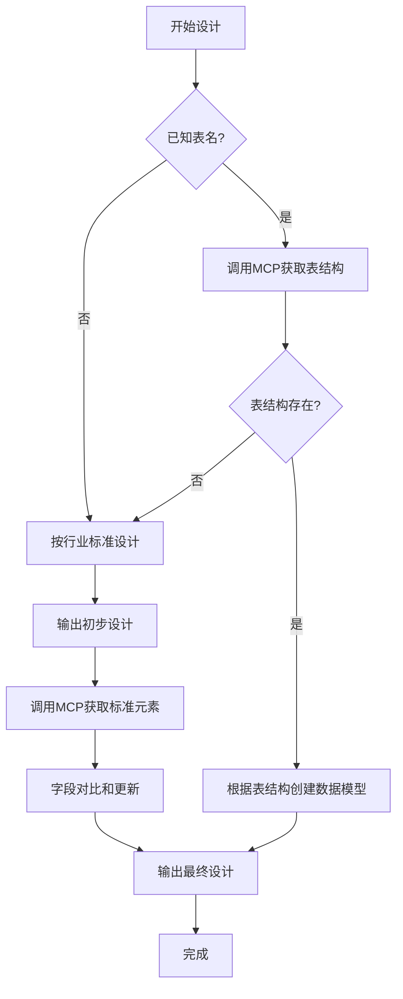

# Java 后端编码智能体 - SQL 编码规范

## 概述

本文档详细说明数据库设计和 SQL 编写规范，适用于 MySQL 和 Oracle 数据库。

## 物理模型和物理表设计规范

### 数据模型设计流程

#### 流程图



### 标准元素定义

**标准元素由 MCP 服务返回，包含以下信息**:

| 字段 | 说明 |
|------|------|
| 英文名称 | 用于数据模型属性名 |
| 中文名称 | 字段的中文描述 |
| 字段名称 | 数据库表字段名 |
| 数据类型 | 字段的数据类型 |
| 长度 | 字段长度 |
| 精度 | 数值字段的精度 |

**获取标准元素**:
- 输入：字段的中文信息
- 输出：标准元素信息

### 物理表字段设计规范

#### 设计原则

1. **字段名来源**: 标准元素的字段名称
2. **字段类型来源**: 标准元素的数据类型
3. **字段长度和精度来源**: 标准元素的长度和精度
4. **无对应标准元素时**: 采用行业标准进行设计
5. **禁止字段名重复**

#### 设计步骤

**第一步：按行业标准设计物理表**

```sql
-- 示例：用户表初步设计
CREATE TABLE TBL_USER (
    id BIGINT PRIMARY KEY COMMENT '用户ID',
    name VARCHAR(50) COMMENT '用户名',
    age INT COMMENT '年龄',
    email VARCHAR(100) COMMENT '邮箱',
    create_time DATETIME COMMENT '创建时间'
);
```

**第二步：输出按行业标准设计的物理表**

```markdown
| 字段名 | 中文名 | 类型 | 长度 | 说明 |
|--------|--------|------|------|------|
| id | 用户ID | BIGINT | - | 主键 |
| name | 用户名 | VARCHAR | 50 | - |
| age | 年龄 | INT | - | - |
| email | 邮箱 | VARCHAR | 100 | - |
| create_time | 创建时间 | DATETIME | - | - |
```

**第三步：获取标准元素**

⚠️ **重要**: 必须调用 MCP 服务获取标准元素

```
调用 MCP 服务：
输入字段中文名：
- 用户ID
- 用户名
- 年龄
- 邮箱
- 创建时间

返回标准元素信息
```

**第四步：字段对比和更新**

```
对比规则：
1. 物理表字段名 ← 标准元素的字段名称
2. 物理表字段类型 ← 标准元素的数据类型
3. 物理表字段长度 ← 标准元素的长度
4. 物理表字段精度 ← 标准元素的精度
```

**第五步：输出最终物理表**

```sql
-- 更新后的用户表（使用标准元素）
CREATE TABLE TBL_USER (
    C_USER_ID BIGINT PRIMARY KEY COMMENT '用户ID',
    C_USER_NAME VARCHAR(100) COMMENT '用户名',
    C_AGE NUMBER(3) COMMENT '年龄',
    C_EMAIL VARCHAR(200) COMMENT '邮箱',
    C_CREATE_TIME TIMESTAMP COMMENT '创建时间'
);
```

### 数据模型设计规范

#### PO 类设计

**要求**:
1. 属性名来源于标准元素的英文名称
2. 如英文名称不是小驼峰形式，需转换为小驼峰
3. 使用 JPA 注解
4. 与数据库表结构完全对应

**示例**:

```java
import javax.persistence.*;
import java.util.Date;

/**
 * 用户持久化对象
 * 
 * @author developer
 * @date 2023-01-01
 */
@Entity
@Table(name = "TBL_USER")
public class UserPO {
    
    /**
     * 用户ID
     * 标准元素英文名：UserId
     */
    @Id
    @Column(name = "C_USER_ID", length = 20)
    private Long userId;
    
    /**
     * 用户名
     * 标准元素英文名：UserName
     */
    @Column(name = "C_USER_NAME", length = 100)
    private String userName;
    
    /**
     * 年龄
     * 标准元素英文名：Age
     */
    @Column(name = "C_AGE", precision = 3)
    private Integer age;
    
    /**
     * 邮箱
     * 标准元素英文名：Email
     */
    @Column(name = "C_EMAIL", length = 200)
    private String email;
    
    /**
     * 创建时间
     * 标准元素英文名：CreateTime
     */
    @Column(name = "C_CREATE_TIME")
    private Date createTime;
    
    // getter/setter 省略
}
```

### 特别要求

⚠️ **最终输出的物理表字段和数据模型属性必须源于标准元素**:

1. 物理表字段名 ← 标准元素的字段名称
2. 物理表字段类型 ← 标准元素的数据类型
3. 物理表字段长度和精度 ← 标准元素的长度和精度
4. 数据模型属性名 ← 标准元素的英文名称（小驼峰形式）

---

## SQL 代码风格规范

### 格式与排版

#### 关键字大写

```sql
-- ✓ 正确：关键字大写
SELECT C_USER_ID, C_USER_NAME
FROM TBL_USER
WHERE C_AGE >= 18
ORDER BY C_CREATE_TIME DESC;

-- ✗ 错误：关键字小写
select c_user_id, c_user_name
from tbl_user
where c_age >= 18
order by c_create_time desc;
```

#### 空格与符号规范

```sql
-- ✓ 正确：关键字前后加空格
WHERE C_AGE=18

-- ✓ 正确：括号前后加空格
LEFT (C_NAME, 2)

-- ✓ 正确：符号前后不加空格
C_AGE>=18, C_NAME='张三'
```

#### 缩进与换行

```sql
-- ✓ 正确：使用2个空格缩进，子句另起一行
SELECT 
  T1.C_USER_ID,
  T1.C_USER_NAME,
  T2.C_DEPT_NAME
FROM TBL_USER T1
  LEFT JOIN TBL_DEPT T2 ON T1.C_DEPT_ID=T2.C_DEPT_ID
WHERE T1.C_STATUS='1'
  AND T1.C_AGE>=18
ORDER BY T1.C_CREATE_TIME DESC;
```

#### 语句长度限制

```
✓ 单条 SQL 长度不应超过 4K (4096 个字节)
```

#### 禁止全角字符

```sql
-- ✗ 错误：使用全角逗号
SELECT C_USER_ID，C_USER_NAME FROM TBL_USER;

-- ✓ 正确：使用半角逗号
SELECT C_USER_ID, C_USER_NAME FROM TBL_USER;
```

### 命名规范

#### 别名规范

```sql
-- ✓ 正确：使用别名，不超过2字符
SELECT 
  A.C_USER_ID,
  A.C_USER_NAME,
  B.C_DEPT_NAME
FROM TBL_USER A
  LEFT JOIN TBL_DEPT B ON A.C_DEPT_ID=B.C_DEPT_ID;

-- ✗ 错误：别名过长
SELECT 
  USER.C_USER_ID,
  USER.C_USER_NAME
FROM TBL_USER USER;

-- ✗ 错误：未使用别名
SELECT 
  TBL_USER.C_USER_ID,
  TBL_USER.C_USER_NAME
FROM TBL_USER;
```

#### 保留字命名

```
✗ 禁止使用数据库保留字作为表名、列名
  例如：DATE, USER, ORDER, GROUP 等
```

#### 分页表命名

```
✓ 分页表以 QT_ 开头
  例如：QT_USER_LIST, QT_ORDER_PAGE
```

### 注释规范

```sql
-- 单行注释：说明查询目的
SELECT C_USER_ID, C_USER_NAME
FROM TBL_USER
WHERE C_STATUS='1';  -- 只查询有效用户

/*
 * 多行注释：说明复杂逻辑
 * 功能：统计各部门的用户数量
 * 算法：按部门分组统计
 */
SELECT 
  C_DEPT_ID,
  COUNT(1) AS USER_COUNT
FROM TBL_USER
GROUP BY C_DEPT_ID;
```

---

## 查询优化规范

### 基本查询优化

#### 禁止使用 SELECT *

```sql
-- ✗ 错误：使用 SELECT *
SELECT * FROM TBL_USER;

-- ✓ 正确：明确列出所需字段
SELECT C_USER_ID, C_USER_NAME, C_AGE FROM TBL_USER;
```

#### 使用绑定变量

```sql
-- ✓ 正确：使用绑定变量
SELECT C_USER_ID, C_USER_NAME
FROM TBL_USER
WHERE C_USER_ID=#{userId};

-- ✗ 错误：直接拼接值
SELECT C_USER_ID, C_USER_NAME
FROM TBL_USER
WHERE C_USER_ID=123;
```

#### 关联表数量限制

```
✓ 单条 SQL 关联表数量不得超过 5 个
```

#### IN 列表限制

**规则**:

| 列表值数量 | 处理方式 |
|-----------|---------|
| < 10 | 直接使用 IN |
| 10-100 | 使用递归子查询转行 |
| > 100 | 先插入临时表再关联 |

**示例**:

```sql
-- 1. 列表值少于10个：直接使用 IN
SELECT C_USER_ID, C_USER_NAME
FROM TBL_USER
WHERE C_USER_ID IN (1, 2, 3, 4, 5);

-- 2. 列表值10-100个：递归子查询（Oracle）
SELECT T1.C_USER_ID, T1.C_USER_NAME
FROM TBL_USER T1,
  (SELECT REGEXP_SUBSTR('1,2,3,4,5,6,7,8,9,10,11', '[^,]+', 1, LEVEL) AS C_ID
   FROM DUAL
   CONNECT BY LEVEL<=11) T_TMP
WHERE T1.C_USER_ID=T_TMP.C_ID;

-- 3. 列表值超过100个：使用临时表
-- 先插入临时表
INSERT INTO GT_USER_IDS (C_USER_ID) VALUES (1), (2), (3)...;

-- 再关联查询
SELECT T1.C_USER_ID, T1.C_USER_NAME
FROM TBL_USER T1
  INNER JOIN GT_USER_IDS T2 ON T1.C_USER_ID=T2.C_USER_ID;
```

#### IN 子查询限制

```sql
-- ✗ 错误：MySQL 禁止索引列使用 IN 子查询
SELECT C_USER_ID, C_USER_NAME
FROM TBL_USER
WHERE C_DEPT_ID IN (SELECT C_DEPT_ID FROM TBL_DEPT WHERE C_STATUS='1');

-- ✓ 正确：改用 JOIN
SELECT T1.C_USER_ID, T1.C_USER_NAME
FROM TBL_USER T1
  INNER JOIN TBL_DEPT T2 ON T1.C_DEPT_ID=T2.C_DEPT_ID
WHERE T2.C_STATUS='1';
```

### 索引使用规范

#### 索引列禁用函数

```sql
-- ✗ 错误：索引列使用函数
SELECT C_USER_ID, C_USER_NAME
FROM TBL_USER
WHERE SUBSTR(C_USER_NAME, 1, 2)='张';

-- ✓ 正确：使用 LIKE
SELECT C_USER_ID, C_USER_NAME
FROM TBL_USER
WHERE C_USER_NAME LIKE '张%';
```

#### 禁止隐式转换

```sql
-- ✗ 错误：字符字段与数字比较（隐式转换）
SELECT C_USER_ID, C_USER_NAME
FROM TBL_USER
WHERE C_USER_CODE=123;

-- ✓ 正确：显式转换
SELECT C_USER_ID, C_USER_NAME
FROM TBL_USER
WHERE C_USER_CODE='123';
```

#### 禁止全表扫描

```
✓ 查询语句必须走索引过滤
✓ 修改、删除必须走主键过滤
```

### JOIN 优化

#### 多表关联编写顺序

```sql
-- ✓ 正确：交叉表在前，按数据量从多到少排列
SELECT 
  T1.C_USER_ID,
  T2.C_DEPT_NAME,
  T3.C_ROLE_NAME
FROM TBL_DEPT T2              -- 交叉表（被引用）
  INNER JOIN TBL_USER T1 ON T1.C_DEPT_ID=T2.C_DEPT_ID  -- 数据量最多
  LEFT JOIN TBL_ROLE T3 ON T1.C_ROLE_ID=T3.C_ROLE_ID;  -- 数据量较少
```

#### 避免嵌套连接

```sql
-- ✗ 错误：嵌套连接
WHERE B.C_ID=A.C_ID 
  AND C.C_ID=B.C_ID 
  AND D.C_ID=C.C_ID;

-- ✓ 正确：直接连接
WHERE B.C_ID=A.C_ID 
  AND C.C_ID=A.C_ID 
  AND D.C_ID=A.C_ID;
```

#### JOIN 类型选择

```sql
-- ✓ 优先使用 INNER JOIN
SELECT T1.C_USER_ID, T2.C_DEPT_NAME
FROM TBL_USER T1
  INNER JOIN TBL_DEPT T2 ON T1.C_DEPT_ID=T2.C_DEPT_ID;

-- ✗ 禁止无效的 LEFT JOIN（外关联表有过滤条件）
SELECT T1.C_USER_ID, T2.C_DEPT_NAME
FROM TBL_USER T1
  LEFT JOIN TBL_DEPT T2 ON T1.C_DEPT_ID=T2.C_DEPT_ID
WHERE T2.C_STATUS='1';  -- 这会使 LEFT JOIN 失效

-- ✗ 禁止使用 FULL JOIN
SELECT T1.C_USER_ID, T2.C_DEPT_NAME
FROM TBL_USER T1
  FULL JOIN TBL_DEPT T2 ON T1.C_DEPT_ID=T2.C_DEPT_ID;

-- ✓ 改用 UNION
SELECT T1.C_USER_ID, T2.C_DEPT_NAME
FROM TBL_USER T1
  LEFT JOIN TBL_DEPT T2 ON T1.C_DEPT_ID=T2.C_DEPT_ID
UNION
SELECT T1.C_USER_ID, T2.C_DEPT_NAME
FROM TBL_USER T1
  RIGHT JOIN TBL_DEPT T2 ON T1.C_DEPT_ID=T2.C_DEPT_ID;
```

### 排序与分组优化

```sql
-- ✓ 减少 ORDER BY 使用
-- 只在必要时排序

-- ✓ 使用 GROUP BY 替代 DISTINCT
-- ✗ 错误
SELECT DISTINCT C_DEPT_ID FROM TBL_USER;

-- ✓ 正确
SELECT C_DEPT_ID FROM TBL_USER GROUP BY C_DEPT_ID;
```

### 子查询与视图优化

#### 禁止等值子查询

```sql
-- ✗ 错误：嵌套等值子查询
SELECT C_USER_ID, C_USER_NAME
FROM TBL_USER
WHERE C_DEPT_ID=(
  SELECT C_DEPT_ID 
  FROM TBL_DEPT 
  WHERE C_DEPT_NAME='研发部'
);

-- ✓ 正确：分步提取
-- 第一步：获取部门ID
Long deptId = getDeptIdByName("研发部");

-- 第二步：查询用户
SELECT C_USER_ID, C_USER_NAME
FROM TBL_USER
WHERE C_DEPT_ID=#{deptId};
```

#### 禁止 NOT IN 子查询

```sql
-- ✗ 错误：使用 NOT IN
SELECT C_USER_ID, C_USER_NAME
FROM TBL_USER
WHERE C_USER_ID NOT IN (
  SELECT C_USER_ID FROM TBL_USER_DELETED
);

-- ✓ 正确：使用 LEFT JOIN + IS NULL
SELECT T1.C_USER_ID, T1.C_USER_NAME
FROM TBL_USER T1
  LEFT JOIN TBL_USER_DELETED T2 ON T1.C_USER_ID=T2.C_USER_ID
WHERE T2.C_USER_ID IS NULL;
```

#### 子查询层级限制

```
✓ 子查询的层级不能超过 3 层
```

#### 禁止视图关联

```
✗ 禁止使用视图进行关联查询
✓ 优先使用表代替视图
```

---

## 数据操作规范

### 数据插入规范

#### 时间写入规范

```sql
-- ✓ 正确：使用数据库时间函数
-- MySQL
INSERT INTO TBL_USER (C_USER_ID, C_USER_NAME, C_CREATE_TIME)
VALUES (1, '张三', NOW());

-- Oracle
INSERT INTO TBL_USER (C_USER_ID, C_USER_NAME, C_CREATE_TIME)
VALUES (1, '张三', SYSDATE);

-- ✗ 错误：使用业务时间
INSERT INTO TBL_USER (C_USER_ID, C_USER_NAME, C_CREATE_TIME)
VALUES (1, '张三', '2023-01-01 10:00:00');
```

#### 字符空值处理

```sql
-- ✓ 正确：插入 NULL
INSERT INTO TBL_USER (C_USER_ID, C_USER_NAME, C_EMAIL)
VALUES (1, '张三', NULL);

-- ✗ 错误：插入空字符串
INSERT INTO TBL_USER (C_USER_ID, C_USER_NAME, C_EMAIL)
VALUES (1, '张三', '');

-- ✓ 正确：查询 NULL
SELECT C_USER_ID, C_USER_NAME
FROM TBL_USER
WHERE C_EMAIL IS NULL;

-- ✗ 错误：查询空字符串
SELECT C_USER_ID, C_USER_NAME
FROM TBL_USER
WHERE C_EMAIL='';
```

### 数据更新与删除规范

#### 禁止全量删除/更新

```sql
-- ✗ 错误：不带条件的删除（事实表）
DELETE FROM TBL_USER;

-- ✗ 错误：不带条件的更新（事实表）
UPDATE TBL_USER SET C_STATUS='1';

-- ✓ 正确：带条件的操作
DELETE FROM TBL_USER WHERE C_USER_ID=123;
UPDATE TBL_USER SET C_STATUS='1' WHERE C_USER_ID=123;

-- ✓ 例外：全局临时表（GT_ 或 TEMP_ 开头）
DELETE FROM GT_USER_TEMP;
TRUNCATE TABLE TEMP_USER_DATA;
```

#### 禁止 TRUNCATE 普通表

```sql
-- ✗ 错误：TRUNCATE 事实表
TRUNCATE TABLE TBL_USER;

-- ✓ 正确：TRUNCATE 临时表
TRUNCATE TABLE GT_USER_TEMP;
```

---

## 特殊功能规范

### 临时表使用规范

#### 禁止创建固定表当临时表

```
✗ 禁止创建固定表作为中间临时表使用
```

#### 临时表创建差异

```sql
-- MySQL：允许创建临时表
CREATE TEMPORARY TABLE TEMP_USER (
  C_USER_ID BIGINT,
  C_USER_NAME VARCHAR(100)
);

-- Oracle：不允许在代码中创建临时表
-- 临时表需要由 DBA 预先创建
```

#### 临时表管理

```sql
-- 使用前清理
-- MySQL
DROP TEMPORARY TABLE IF EXISTS TEMP_USER;

-- Oracle
TRUNCATE TABLE GT_USER_TEMP;

-- 使用完成后回收
-- MySQL
DROP TEMPORARY TABLE TEMP_USER;

-- Oracle
TRUNCATE TABLE GT_USER_TEMP;
```

### 分页查询规范

```
✓ 单次返回记录数不得超过 1000 行
✓ 分页表仅允许插入操作
✓ 关联查询时通过主键关联维表
✗ 禁止通过关联表过滤
```

### 分区表使用规范

```sql
-- ✓ 正确：使用分区键过滤
SELECT C_USER_ID, C_USER_NAME
FROM TBL_USER_PARTITION
WHERE C_YEAR=2023  -- 分区键
  AND C_STATUS='1';

-- ✗ 错误：未使用分区键
SELECT C_USER_ID, C_USER_NAME
FROM TBL_USER_PARTITION
WHERE C_STATUS='1';
```

---

## Oracle 特有规范

### MERGE INTO 使用规范

```sql
-- ✓ 正确：MERGE INTO 用法
MERGE INTO TBL_USER T1
USING (SELECT C_USER_ID, C_USER_NAME FROM TBL_USER_TEMP) T2
ON (T1.C_USER_ID=T2.C_USER_ID)
WHEN MATCHED THEN
  UPDATE SET T1.C_USER_NAME=T2.C_USER_NAME
WHEN NOT MATCHED THEN
  INSERT (C_USER_ID, C_USER_NAME)
  VALUES (T2.C_USER_ID, T2.C_USER_NAME);

-- ✗ 错误：独立 NOT MATCHED 子句
MERGE INTO TBL_USER T1
USING (SELECT C_USER_ID, C_USER_NAME FROM TBL_USER_TEMP) T2
ON (T1.C_USER_ID=T2.C_USER_ID)
WHEN NOT MATCHED THEN
  INSERT (C_USER_ID, C_USER_NAME)
  VALUES (T2.C_USER_ID, T2.C_USER_NAME);

-- ✗ 错误：MATCHED 后使用 DELETE
MERGE INTO TBL_USER T1
USING (SELECT C_USER_ID FROM TBL_USER_TEMP) T2
ON (T1.C_USER_ID=T2.C_USER_ID)
WHEN MATCHED THEN
  UPDATE SET T1.C_STATUS='0'
  DELETE WHERE T1.C_AGE<18;  -- 禁止

-- ✗ 错误：ON 子句中使用外关联
MERGE INTO TBL_USER T1
USING TBL_USER_TEMP T2
ON (T1.C_USER_ID=T2.C_USER_ID(+))  -- 禁止外关联语法
WHEN MATCHED THEN
  UPDATE SET T1.C_USER_NAME=T2.C_USER_NAME;
```

---

## 禁止事项

### 禁止动态拼接恒等式

```sql
-- ✗ 错误：拼接 WHERE 1=1
SELECT C_USER_ID, C_USER_NAME
FROM TBL_USER
WHERE 1=1
  AND C_STATUS='1';

-- ✓ 正确：直接使用条件
SELECT C_USER_ID, C_USER_NAME
FROM TBL_USER
WHERE C_STATUS='1';
```

### 禁止自定义函数 DML

```
✗ 函数中禁止包含 INSERT/UPDATE/DELETE 操作
```

### 禁止使用业务代码记录日志

```
✗ 业务代码不允许使用 ECP_SQL_TRACE 表记录日志
```

### 禁止自定义函数

```
✗ 查询列和过滤值中禁止使用自定义函数
```

---

## 最佳实践总结

### 设计阶段

```
✓ 优先调用 MCP 获取表结构和标准元素
✓ 物理表字段严格遵循标准元素
✓ 数据模型属性使用标准元素英文名（小驼峰）
✓ 使用 JPA 注解定义 PO 类
```

### 编写阶段

```
✓ SQL 关键字大写
✓ 使用别名，不超过2字符
✓ 明确列出所需字段，禁止 SELECT *
✓ 使用绑定变量
✓ SQL 语句放在配置文件中
```

### 优化阶段

```
✓ 确保查询走索引
✓ 避免在循环中访问数据库
✓ 合理使用 JOIN 类型
✓ 控制关联表数量（≤5个）
✓ 注意 IN 列表大小限制
```

### 安全阶段

```
✓ 防止 SQL 注入
✓ 避免隐式类型转换
✓ 使用数据库时间函数
✓ 正确处理 NULL 值
```

## 下一步

- 💾 查看 [数据交互](./06-data-interaction.md) 了解数据库操作方法
- 🔧 参考 [专项功能](./07-special-features.md) 了解缓存、消息等功能
- 📚 学习 [最佳实践](./08-best-practices.md) 了解开发技巧
