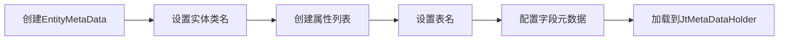

# Java 后端编码智能体 - 数据交互指南

## 概述

本文档介绍如何在 Java 代码中与数据库进行交互，包括元数据初始化和基本的 CRUD 操作。

## 元数据初始化

### 为什么需要元数据初始化

在进行数据库操作前，需要先初始化实体类的元数据，建立 Java 对象与数据库表之间的映射关系。这是使用框架提供的数据持久化和查询服务的前提。

### 元数据初始化步骤



### 完整示例代码

```java
import com.ygsoft.jt.teng.fw.core.base.metadata.EntityMetaData;
import com.ygsoft.jt.teng.fw.core.base.metadata.PropertyMetaData;
import com.ygsoft.jt.teng.fw.core.base.metadata.JtMetaDataHolder;
import com.ygsoft.jt.teng.fw.core.base.metadata.PropertyDataTypeEnum;
import com.ygsoft.jt.teng.fw.core.base.metadata.PropertyTypeEnum;

import java.util.ArrayList;
import java.util.List;

/**
 * 用户实体元数据初始化
 */
public class UserMetaDataInitializer {
    
    /**
     * 初始化用户实体元数据
     */
    public void initializeMetaData() {
        // 1. 创建 EntityMetaData 对象
        final EntityMetaData metaData = new EntityMetaData();
        
        // 2. 设置实体类名称
        metaData.setEntityName(UserPO.class.getName());
        
        // 3. 创建属性列表
        final List<PropertyMetaData> props = new ArrayList<>();
        metaData.setColList(props);
        
        // 4. 设置表名
        metaData.setTableName("TBL_USER");
        
        // 5. 配置字段元数据
        
        // userId 字段（主键）
        PropertyMetaData propUserId = new PropertyMetaData();
        propUserId.setName("userId");                    // Java 属性名
        propUserId.setMapName("C_USER_ID");              // 数据库字段名
        propUserId.setDataType(PropertyDataTypeEnum.LONG); // 数据类型
        propUserId.setPropEnum(PropertyTypeEnum.ID);     // 标识为主键
        propUserId.setLength(20);                        // 长度
        props.add(propUserId);
        
        // userName 字段
        PropertyMetaData propUserName = new PropertyMetaData();
        propUserName.setName("userName");
        propUserName.setMapName("C_USER_NAME");
        propUserName.setDataType(PropertyDataTypeEnum.STRING);
        propUserName.setLength(100);
        props.add(propUserName);
        
        // age 字段
        PropertyMetaData propAge = new PropertyMetaData();
        propAge.setName("age");
        propAge.setMapName("C_AGE");
        propAge.setDataType(PropertyDataTypeEnum.INTEGER);
        propAge.setLength(3);
        props.add(propAge);
        
        // email 字段
        PropertyMetaData propEmail = new PropertyMetaData();
        propEmail.setName("email");
        propEmail.setMapName("C_EMAIL");
        propEmail.setDataType(PropertyDataTypeEnum.STRING);
        propEmail.setLength(200);
        props.add(propEmail);
        
        // createTime 字段
        PropertyMetaData propCreateTime = new PropertyMetaData();
        propCreateTime.setName("createTime");
        propCreateTime.setMapName("C_CREATE_TIME");
        propCreateTime.setDataType(PropertyDataTypeEnum.DATE);
        props.add(propCreateTime);
        
        // status 字段
        PropertyMetaData propStatus = new PropertyMetaData();
        propStatus.setName("status");
        propStatus.setMapName("C_STATUS");
        propStatus.setDataType(PropertyDataTypeEnum.STRING);
        propStatus.setLength(10);
        props.add(propStatus);
        
        // 6. 加载元数据到 JtMetaDataHolder
        JtMetaDataHolder.instance.loadMetaData(UserPO.class.getName(), metaData);
    }
}
```

### PropertyMetaData 配置说明

| 属性 | 说明 | 示例 |
|------|------|------|
| name | Java 属性名（小驼峰） | userId |
| mapName | 数据库字段名 | C_USER_ID |
| dataType | 数据类型枚举 | PropertyDataTypeEnum.LONG |
| propEnum | 属性类型（主键等） | PropertyTypeEnum.ID |
| length | 字段长度 | 20 |

### PropertyDataTypeEnum 枚举值

```java
PropertyDataTypeEnum.STRING    // 字符串
PropertyDataTypeEnum.INTEGER   // 整数
PropertyDataTypeEnum.LONG      // 长整数
PropertyDataTypeEnum.DOUBLE    // 双精度浮点数
PropertyDataTypeEnum.DECIMAL   // 精确小数
PropertyDataTypeEnum.DATE      // 日期时间
PropertyDataTypeEnum.BOOLEAN   // 布尔值
```

### PropertyTypeEnum 枚举值

```java
PropertyTypeEnum.ID            // 主键
PropertyTypeEnum.NORMAL        // 普通字段（默认）
```

---

## 数据库 CRUD 操作

### 服务接口说明

框架提供两个核心服务接口：

1. **IJtDataPersistService**: 数据持久化服务（增、删、改）
2. **IJtDataQueryService**: 数据查询服务（查）

### 新增和修改操作

#### 使用 save 方法

`save` 方法会根据主键自动判断是执行插入还是更新操作。

```java
import com.ygsoft.jt.teng.fw.core.base.service.IJtDataPersistService;
import org.springframework.beans.factory.annotation.Autowired;
import org.springframework.stereotype.Service;

@Service
public class UserService {
    
    @Autowired
    private IJtDataPersistService persistService;
    
    /**
     * 创建用户
     */
    public void createUser() {
        // 创建用户对象
        UserPO user = new UserPO();
        user.setUserId(123456L);
        user.setUserName("张三");
        user.setAge(25);
        user.setEmail("zhangsan@example.com");
        user.setStatus("1");
        
        // 保存到数据库
        // 如果主键不存在，执行 INSERT
        // 如果主键已存在，执行 UPDATE
        persistService.save(user);
    }
    
    /**
     * 更新用户
     */
    public void updateUser() {
        // 创建用户对象（包含主键）
        UserPO user = new UserPO();
        user.setUserId(123456L);  // 已存在的主键
        user.setUserName("李四");  // 更新用户名
        user.setAge(30);          // 更新年龄
        
        // 保存到数据库
        // 因为主键已存在，执行 UPDATE
        persistService.save(user);
    }
    
    /**
     * 批量保存
     */
    public void batchSave() {
        List<UserPO> users = new ArrayList<>();
        
        for (int i = 0; i < 100; i++) {
            UserPO user = new UserPO();
            user.setUserId(Long.valueOf(i));
            user.setUserName("用户" + i);
            user.setAge(20 + i % 50);
            users.add(user);
        }
        
        // 批量保存
        for (UserPO user : users) {
            persistService.save(user);
        }
    }
}
```

#### IJtDataPersistService 接口方法

```java
/**
 * 保存实体对象
 * 根据主键自动判断是插入还是更新
 */
void save(Object entity);

/**
 * 保存实体对象（指定实体名）
 */
void save(String entityName, Object entity);
```

### 删除操作

#### 根据主键删除

```java
import com.ygsoft.jt.teng.fw.core.base.service.IJtDataPersistService;
import org.springframework.beans.factory.annotation.Autowired;
import org.springframework.stereotype.Service;

@Service
public class UserService {
    
    @Autowired
    private IJtDataPersistService persistService;
    
    /**
     * 根据主键删除用户
     */
    public void deleteUser(Long userId) {
        // 直接传入主键值
        persistService.delete(userId);
    }
    
    /**
     * 批量删除
     */
    public void batchDelete(List<Long> userIds) {
        for (Long userId : userIds) {
            persistService.delete(userId);
        }
    }
}
```

#### IJtDataPersistService 删除方法

```java
/**
 * 根据主键删除
 */
void delete(Serializable primaryKey);

/**
 * 根据主键删除（指定实体名）
 */
void delete(String entityName, Serializable primaryKey);
```

### 查询操作

#### 条件查询

```java
import com.ygsoft.jt.teng.fw.core.base.service.IJtDataQueryService;
import com.ygsoft.jt.teng.fw.core.base.model.ItemCondition;
import com.ygsoft.jt.teng.fw.core.base.model.ItemConditionOp;
import com.ygsoft.jt.teng.fw.core.base.model.PageModel;
import org.springframework.beans.factory.annotation.Autowired;
import org.springframework.stereotype.Service;

import java.util.ArrayList;
import java.util.List;

@Service
public class UserQueryService {
    
    @Autowired
    private IJtDataQueryService queryService;
    
    /**
     * 根据条件查询用户列表
     */
    public List<UserPO> findUsersByCondition(String userName, Integer minAge) {
        // 构建查询条件
        List<ItemCondition> conditions = new ArrayList<>();
        
        // 用户名等于
        if (userName != null && !userName.isEmpty()) {
            ItemCondition condition1 = new ItemCondition(
                "userName",           // 属性名
                ItemConditionOp.EQ,   // 操作符：等于
                userName              // 值
            );
            conditions.add(condition1);
        }
        
        // 年龄大于等于
        if (minAge != null) {
            ItemCondition condition2 = new ItemCondition(
                "age",
                ItemConditionOp.GE,   // 操作符：大于等于
                minAge
            );
            conditions.add(condition2);
        }
        
        // 分页查询（第1页，每页1000条）
        PageModel<?> page = queryService.findByPageWithCondition(
            conditions,
            1,      // 页码（从1开始）
            1000    // 每页大小
        );
        
        // 获取结果列表
        List<UserPO> users = (List<UserPO>) page.getItems();
        
        return users;
    }
    
    /**
     * 复杂条件查询示例
     */
    public List<UserPO> findUsersWithComplexCondition() {
        List<ItemCondition> conditions = new ArrayList<>();
        
        // 用户名包含"张"
        conditions.add(new ItemCondition(
            "userName",
            ItemConditionOp.LIKE,
            "%张%"
        ));
        
        // 年龄在20-30之间
        conditions.add(new ItemCondition(
            "age",
            ItemConditionOp.GE,
            20
        ));
        conditions.add(new ItemCondition(
            "age",
            ItemConditionOp.LE,
            30
        ));
        
        // 状态为有效
        conditions.add(new ItemCondition(
            "status",
            ItemConditionOp.EQ,
            "1"
        ));
        
        // 执行查询
        PageModel<?> page = queryService.findByPageWithCondition(
            conditions,
            1,
            100
        );
        
        return (List<UserPO>) page.getItems();
    }
}
```

#### ItemConditionOp 操作符

| 操作符 | 说明 | 示例 |
|--------|------|------|
| EQ | 等于 (=) | ItemConditionOp.EQ |
| NE | 不等于 (!=) | ItemConditionOp.NE |
| GT | 大于 (>) | ItemConditionOp.GT |
| GE | 大于等于 (>=) | ItemConditionOp.GE |
| LT | 小于 (<) | ItemConditionOp.LT |
| LE | 小于等于 (<=) | ItemConditionOp.LE |
| LIKE | 模糊匹配 | ItemConditionOp.LIKE |
| IN | 在列表中 | ItemConditionOp.IN |
| NOT_IN | 不在列表中 | ItemConditionOp.NOT_IN |
| IS_NULL | 为空 | ItemConditionOp.IS_NULL |
| IS_NOT_NULL | 不为空 | ItemConditionOp.IS_NOT_NULL |

#### 分页查询详解

```java
/**
 * 分页查询方法
 * 
 * @param conditions 查询条件列表
 * @param pageNo 页码（从1开始）
 * @param pageSize 每页大小（建议不超过1000）
 * @return 分页结果
 */
PageModel<?> findByPageWithCondition(
    List<ItemCondition> conditions,
    int pageNo,
    int pageSize
);
```

**PageModel 对象**:

```java
// 获取结果列表
List<?> items = page.getItems();

// 获取总记录数
long totalCount = page.getTotalCount();

// 获取总页数
int totalPages = page.getTotalPages();

// 获取当前页码
int currentPage = page.getCurrentPage();

// 获取每页大小
int pageSize = page.getPageSize();
```

---

## 完整使用示例

### 示例：用户管理服务

```java
import com.ygsoft.jt.teng.fw.core.base.service.IJtDataPersistService;
import com.ygsoft.jt.teng.fw.core.base.service.IJtDataQueryService;
import com.ygsoft.jt.teng.fw.core.base.model.ItemCondition;
import com.ygsoft.jt.teng.fw.core.base.model.ItemConditionOp;
import com.ygsoft.jt.teng.fw.core.base.model.PageModel;
import org.springframework.beans.factory.annotation.Autowired;
import org.springframework.stereotype.Service;
import org.springframework.transaction.annotation.Transactional;

import java.util.ArrayList;
import java.util.Date;
import java.util.List;

/**
 * 用户管理服务
 */
@Service
@Transactional(rollbackFor = Exception.class)
public class UserManagementService {
    
    @Autowired
    private IJtDataPersistService persistService;
    
    @Autowired
    private IJtDataQueryService queryService;
    
    /**
     * 创建用户
     */
    public Long createUser(String userName, Integer age, String email) {
        // 生成用户ID（实际应用中可能使用ID生成器）
        Long userId = System.currentTimeMillis();
        
        // 创建用户对象
        UserPO user = new UserPO();
        user.setUserId(userId);
        user.setUserName(userName);
        user.setAge(age);
        user.setEmail(email);
        user.setStatus("1");  // 有效状态
        user.setCreateTime(new Date());
        
        // 保存到数据库
        persistService.save(user);
        
        return userId;
    }
    
    /**
     * 更新用户信息
     */
    public void updateUser(Long userId, String userName, Integer age) {
        // 先查询用户
        UserPO user = findUserById(userId);
        
        if (user == null) {
            throw new RuntimeException("用户不存在");
        }
        
        // 更新字段
        if (userName != null) {
            user.setUserName(userName);
        }
        if (age != null) {
            user.setAge(age);
        }
        
        // 保存更新
        persistService.save(user);
    }
    
    /**
     * 删除用户
     */
    public void deleteUser(Long userId) {
        persistService.delete(userId);
    }
    
    /**
     * 根据ID查询用户
     */
    public UserPO findUserById(Long userId) {
        List<ItemCondition> conditions = new ArrayList<>();
        conditions.add(new ItemCondition("userId", ItemConditionOp.EQ, userId));
        
        PageModel<?> page = queryService.findByPageWithCondition(conditions, 1, 1);
        
        List<UserPO> users = (List<UserPO>) page.getItems();
        
        return users.isEmpty() ? null : users.get(0);
    }
    
    /**
     * 查询用户列表
     */
    public List<UserPO> findUsers(String userName, Integer minAge, Integer maxAge) {
        List<ItemCondition> conditions = new ArrayList<>();
        
        // 用户名模糊查询
        if (userName != null && !userName.isEmpty()) {
            conditions.add(new ItemCondition(
                "userName",
                ItemConditionOp.LIKE,
                "%" + userName + "%"
            ));
        }
        
        // 年龄范围
        if (minAge != null) {
            conditions.add(new ItemCondition("age", ItemConditionOp.GE, minAge));
        }
        if (maxAge != null) {
            conditions.add(new ItemCondition("age", ItemConditionOp.LE, maxAge));
        }
        
        // 只查询有效用户
        conditions.add(new ItemCondition("status", ItemConditionOp.EQ, "1"));
        
        // 分页查询
        PageModel<?> page = queryService.findByPageWithCondition(conditions, 1, 1000);
        
        return (List<UserPO>) page.getItems();
    }
    
    /**
     * 分页查询用户
     */
    public PageModel<UserPO> findUsersByPage(
            String userName,
            int pageNo,
            int pageSize) {
        
        List<ItemCondition> conditions = new ArrayList<>();
        
        if (userName != null && !userName.isEmpty()) {
            conditions.add(new ItemCondition(
                "userName",
                ItemConditionOp.LIKE,
                "%" + userName + "%"
            ));
        }
        
        PageModel<?> page = queryService.findByPageWithCondition(
            conditions,
            pageNo,
            pageSize
        );
        
        return (PageModel<UserPO>) page;
    }
    
    /**
     * 批量创建用户
     */
    public void batchCreateUsers(List<UserPO> users) {
        for (UserPO user : users) {
            persistService.save(user);
        }
    }
}
```

---

## 注意事项

### 1. 元数据初始化时机

```
✓ 在应用启动时初始化
✓ 在第一次使用实体前初始化
✗ 不要在每次操作时重复初始化
```

### 2. 主键处理

```
✓ save 方法会根据主键判断插入或更新
✓ delete 方法需要传入主键值
✓ 确保主键值的唯一性
```

### 3. 分页参数

```
✓ 页码从 1 开始计数
✓ 每页大小建议不超过 1000
✓ 查询方法内部会自动执行 count 和分页
```

### 4. 查询条件

```
✓ 使用 ItemCondition 构建查询条件
✓ 多个条件之间是 AND 关系
✓ 属性名使用 Java 属性名（小驼峰）
```

### 5. 事务管理

```
✓ 在 Service 层使用 @Transactional
✓ 持久化操作需要事务支持
✓ 查询操作可以不开启事务
```

### 6. 性能优化

```
✓ 避免在循环中执行数据库操作
✓ 使用批量操作代替单条操作
✓ 合理设置分页大小
✓ 只查询需要的字段
```

---

## 最佳实践

### 1. 封装数据访问层

```java
@Repository
public class UserDao {
    
    @Autowired
    private IJtDataPersistService persistService;
    
    @Autowired
    private IJtDataQueryService queryService;
    
    public void save(UserPO user) {
        persistService.save(user);
    }
    
    public void delete(Long userId) {
        persistService.delete(userId);
    }
    
    public UserPO findById(Long userId) {
        // 实现查询逻辑
    }
    
    public List<UserPO> findByCondition(UserQueryCondition condition) {
        // 实现条件查询逻辑
    }
}
```

### 2. 使用 BO 和 PO 分离

```java
@Service
public class UserService {
    
    @Autowired
    private UserDao userDao;
    
    @Autowired
    private UserTransfer userTransfer;
    
    public void createUser(UserBO userBO) {
        // BO 转 PO
        UserPO userPO = userTransfer.boToPo(userBO);
        
        // 保存
        userDao.save(userPO);
    }
}
```

### 3. 统一异常处理

```java
public UserPO findUserById(Long userId) {
    UserPO user = userDao.findById(userId);
    
    if (user == null) {
        throw new BusinessException("1001", "用户不存在");
    }
    
    return user;
}
```

## 下一步

- 🔧 参考 [专项功能](./07-special-features.md) 了解缓存、消息等功能
- 📚 学习 [最佳实践](./08-best-practices.md) 了解开发技巧
- 📖 回顾 [编码规范](./04-coding-standards.md) 确保代码质量
